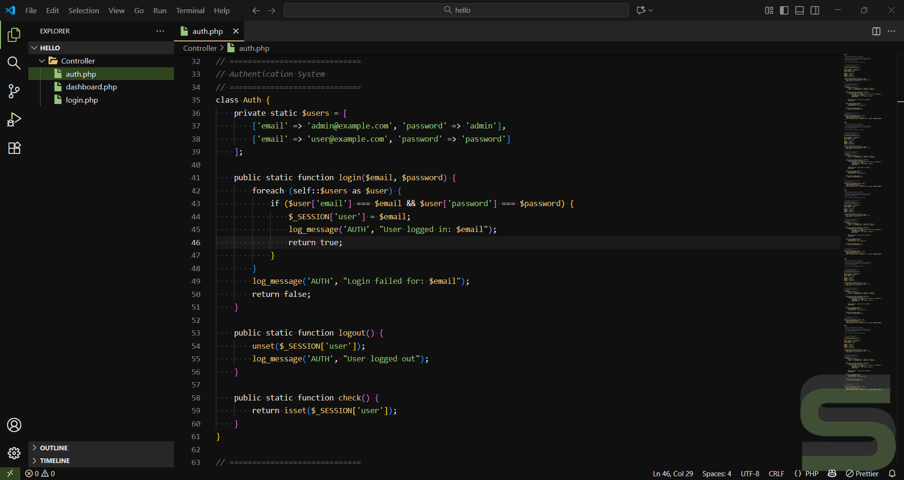

# Savari VS Code Theme

### How to Install

- Go to `Extensions` or `Ctrl+Shift+X`
- Search: "Savari" → `Install`
- Activate Theme: `Settings` → `Themes` → `Color Theme` → Choose: "Savari Themes"
- Activate Icon: `Settings` → `Themes` → `File Icons Theme` → Choose: "Savari Icons"

**Savari** is a dark theme for Visual Studio Code designed for visual comfort and readability during long coding sessions. Its colors are inspired by earthy tones, creating a calm and focused atmosphere for your work. It is perfect for developers who prefer a quiet, distraction-free environment that remains comfortable over time. The theme also includes icons from [Icons Collection](https://www.svgrepo.com/collection/chunk-16px-thick-interface-icons). We hope this theme enhances your productivity and makes coding more enjoyable.
